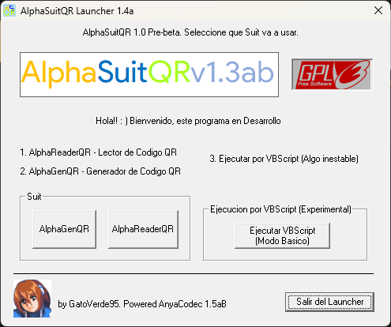
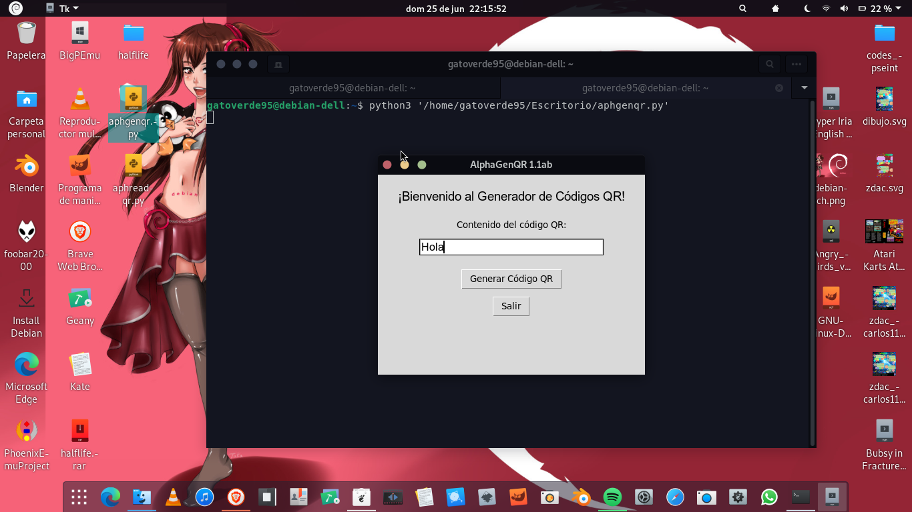
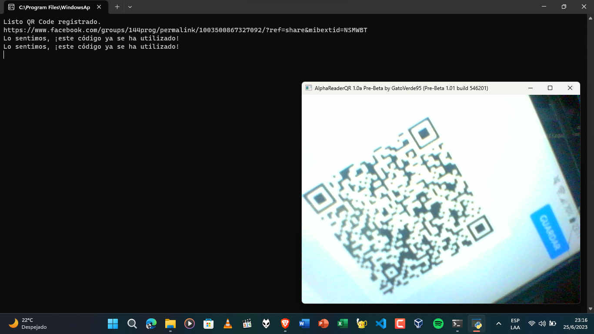

<!-- Logo -->

  

<!-- Título del proyecto -->
# AlphaSuitQR + Launcher (No Legacy)

<!-- Descripción -->
Es un programa basico de uso educativo en las clases de Programacion orientado a escaneo de codigos incriptados en lenguaje QR, basado en el lenguaje de Python, VBScript y su interfaz programado en Visual Basic en Objetos. En este repositorio se encuentra su codigo fuente con todos los assets, recursos y de manera portable solo si Python se encuentra en el ordenador que tenga Windows (Ocupa Wine en Linux y macOS). Basado en su version Legacy, reprogramado con un Launcher nuevo y caracteristicas.

No es compatible Android con el uso de archivos . sh como ejecutables pero si con el formato PY. Para Linux y macOS solo esta disponible en Source Code sin instalacion mientas en Windows solo en portable y Auto-extraible.

Este codigo fuente esta protegido por una GNU General Public License v3.0 lo cual lo hace libre su uso y su codigo fuente.

<!-- Capturas de pantalla -->
## Capturas de pantalla

| Descripción | Captura de pantalla |
| ----------- | ------------------ |
| Launcher (Solo en Windows) |  |
| AlphaGenQR |  |
| AlphaReadQR |  |

<!-- Instalación -->
## Instalación

En Windows se tiene la version Portable que solo para extraer y el Auto-Extraible que hace el trabajo de una sola vez. Nota: debe estar instalado Python en Windows para no tener confilictos en la ejecucion del codigo.

En Linux y macOS se tiene que extraer el .zip en una carpeta.

- Para Windows se deben instalar los proximos repositorios con Windows PowerShell (Administrador):

   pip install qrcode | pip install pyzbar | pip install pillow
  

- Para Linux y macOS se deben instalar los proximos repositorios con su respectiva Terminal ejecutando Python:

   pip install qrcode | pip install pyzbar

<!-- Uso -->
## Uso

Su uso es intractivo en Windows ya cuenta con una interfaz lo cual lo hace facil. Pero Linux y macOS se debe ejecutar desde el codigo osea desde su respectivo archivo PY. 

aphgenqr.py es un generador de codigos QR el cual solo se ejecuta, se escribe un maximo de 150 letras para que luego se compile en un archivo de imagen con formato PNG.

aphreadqr.py es un lector de codigos QR el cual solo se ejecuta, se visualiza una ventana el cual imprimira el codigo en texto en la terminal al ejecutarse puede ser links o texto natural.

<!-- Contribución -->
## Contribución

Este proyecto esta diseñado para uso experimental y educativo.

<!-- Licencia -->
## Licencia

Este proyecto tiene su licencia GNU General Public License v3.0
